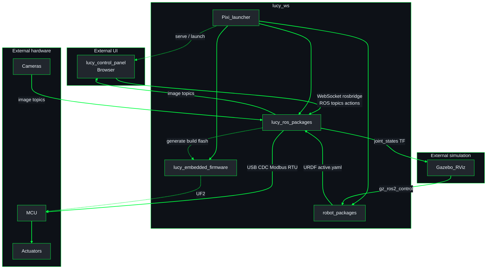

# Lucy system architecture

High-level view of **`lucy_ws` and its packages** as black boxes, plus
**external actors** (control panel in the browser, MCU boards, actuators,
cameras, sim). Package internals live in each package’s `docs/architecture/`.
Index: [README.md](./README.md). Conventions for authors: [GUIDE.md](./GUIDE.md).

## System schematic

**UML Component (system context)** - Lucy workspace boundary and external actors.

| Node | Meaning |
|------|---------|
| `lucy_control_panel` | External UI - React app in the browser (rosbridge client) |
| `Pixi_launcher` | Pixi env, `repos.json`, Control Center / launch |
| `lucy_ros_packages` | Bringup, ros2_control, config pipeline, Modbus bridge, cameras, msgs |
| `robot_packages` | `*_urdf` packages (e.g. `inmoov_urdf`, `so_arm101_urdf`) |
| `MCU` | Microcontrollers |
| `Actuators` | PWM and/or UART bus motors (and related I2C/ADC devices when configured) |
| `Gazebo_RViz` | Sim / viz; no Modbus |

## How the pieces connect (real robot)

| From | To | Path |
|------|-----|------|
| `lucy_control_panel` (browser) | `lucy_ros_packages` | rosbridge WebSocket: trajectories, config services/actions, camera subscribe |
| Robot packages (`*_urdf`) | `lucy_ros_packages` | URDF + `config/hardware/active.yaml` (radians) |
| Config pipeline | `lucy_embedded_firmware` | Per-board YAML → Cargo build → UF2 flash |
| ros2_control | MCU | `LucySystemHardware` → SHM → `lucy_modbus_bridge` → USB Modbus |
| MCU | Actuators | PWM and/or UART bus (plus I2C/ADC when configured) |
| Cameras | Control panel | ROS image topics through bringup → rosbridge |
| Gazebo | Robot | `gz_ros2_control` - **no** SHM/Modbus |

## Units (cross-cutting)

| Layer | Unit |
|-------|------|
| Robot hardware YAML | radians |
| Control panel editors | degrees (UI only) |
| SHM + Modbus registers | milliradians |

## Multi-robot

Launcher `robot_package` selects which robot package’s URDF and
`config/hardware/` tree the stack uses. Workspace `config/repos.json` only
pins git remotes/branches.

## Related

- [Architecture index](./docs/architecture/README.md)
- [Architecture guide](./GUIDE.md)
- [ros2_control notes](../../src/lucy_ros_packages/docs/ROS2_CONTROL.md)
- [Pipeline / SHM](../../src/lucy_ros_packages/docs/architecture/pipeline_shm.md)
- [Firmware](../../src/lucy_embedded_firmware/docs/architecture/firmware.md)
